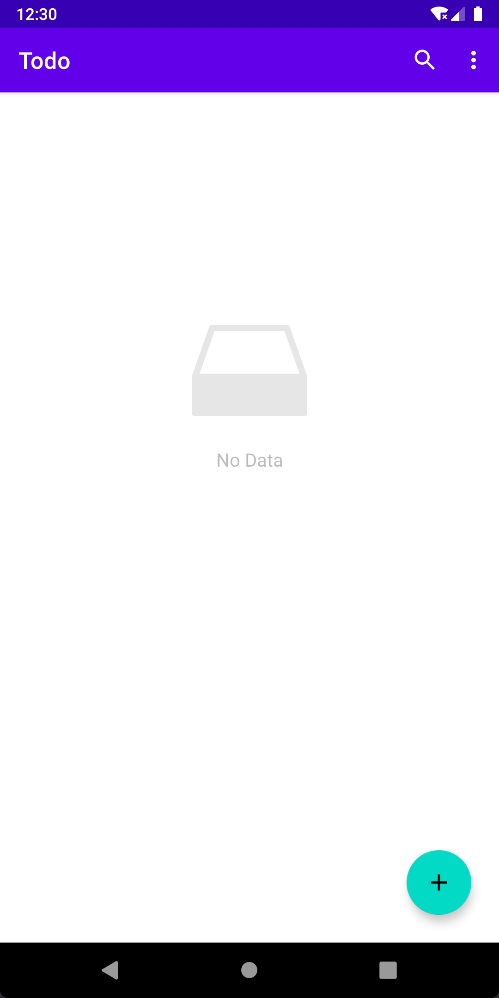
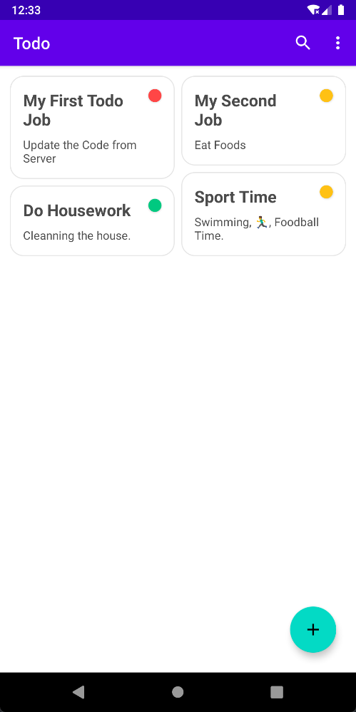
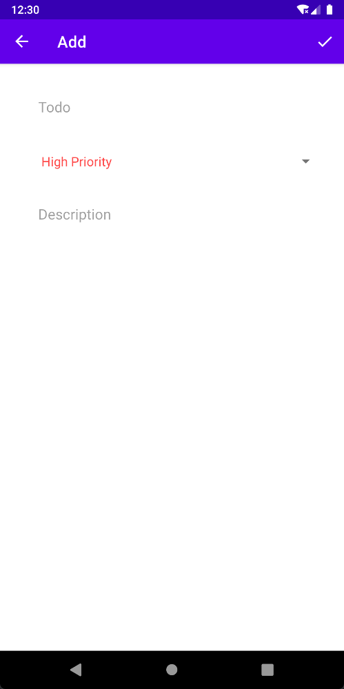
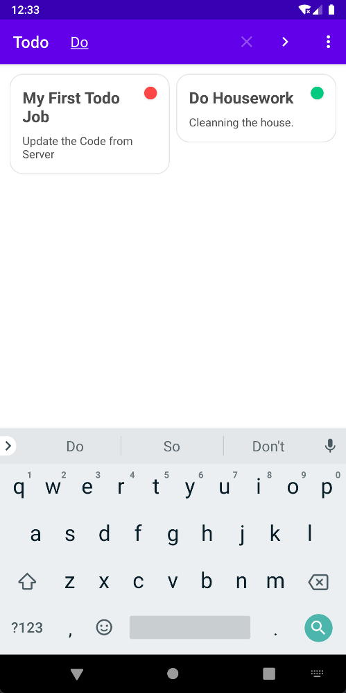
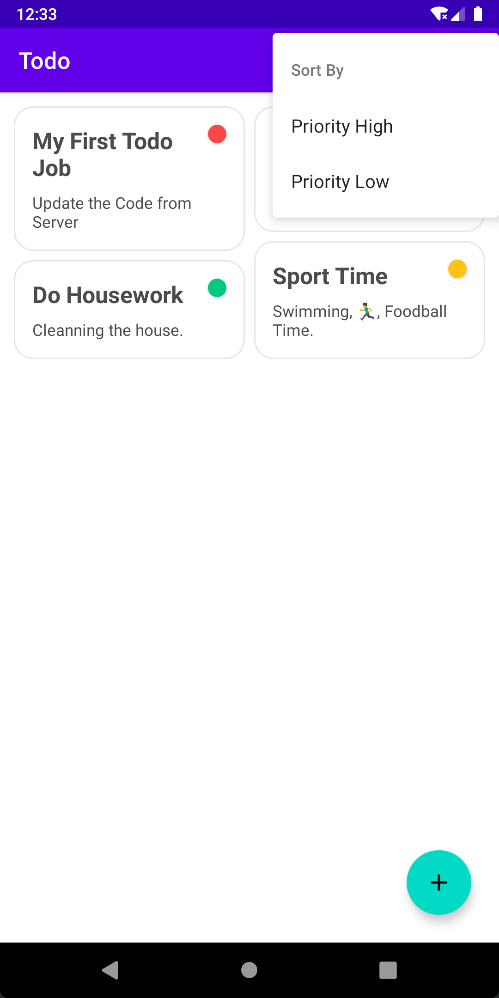
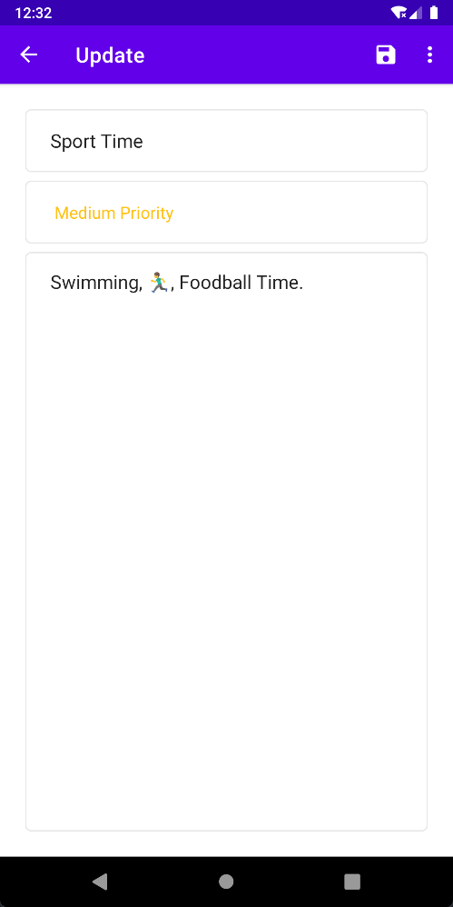

# Todo List App

## Introduction

Inspired by [To-Do App & Clean Architecture - Android Development - Kotlin](https://www.udemy.com/course/to-do-app-clean-architecture-android-development-kotlin/)

## Screen Shots

| Page       | Screenshots                                     | Page             | Screenshots                                 | Page   | Screenshots                                     |
|:----------:|:-----------------------------------------------:|:----------------:|:-------------------------------------------:|:------:|:-----------------------------------------------:|
| Empty View |             | Home Page        |       | Add    |             |
| Search     |  | Sort By Priority |  | Update |  |
